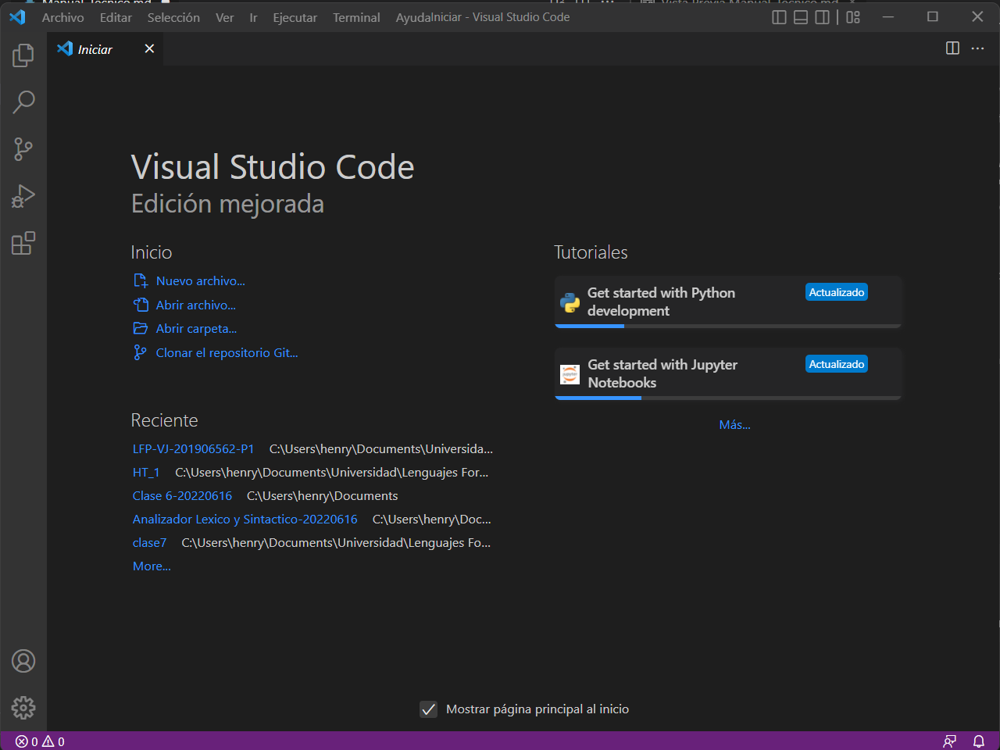
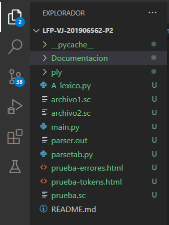

# **MANUAL DE TECNICO**


## Simple C

## **INDICE**
  - [**INDICE**](#indice)
  - [**SOBRE EL PROGRAMA**](#sobre-el-programa)
  - [**CONOCIMIENTOS PREVIOS**](#conocimientos-previos)
  - [**ESPECIFICACIONES TECNICAS**](#especificaciones-tecnicas)
  - [**FUNCIONES DEL CODIGO**](#funciones-del-codigo)

## **SOBRE EL PROGRAMA**
El progama tiene como objetivo de leer un archivo de extension .sc, el contendido del archivo estara dado por la estructura de un codigo realizo en el lenguaje C o C++, donde se estara dando un reporte de tokens lexicos, un AST y reporte de errores lexicos y sintacticos, sobre el analisis del codigo leido en el archivo.

## **CONOCIMIENTOS PREVIOS**
Los conocimientos mínimos que deben tener las personas que operarán las páginas y deberán utilizar este manual son:
- Conocimientos básicos de python
- Conocimientos básicos en Visual Studio Code.
- Conocimiento básico de HTML
- Conocimiento básico de Framework (Bootstrap)
- Conocimiento básico PLY(lex y yacc)
- Conocimiento básico gramaticas

## **ESPECIFICACIONES TECNICAS**
Se debe cumplir con los siguientes requisitos antes de usar el programa.

- **Sistema operativo:** windows 7, 8, 8.1 o 10 u otro sistema operativo que permita usar python 
- **Lenguaje de programacion:** Python y Framework (Bootstrap 2.8)
- **Editor de codigo:** Visual Studio Code, Atom, Pycharm, Nano, etc...
- **Navegador web:** : Cualquier versión de Google Chrome 
- **Archivo PLY:** : Se debera tener la version de 3.11 u otro 

## **FUNCIONES DEL CODIGO**
A continuacion se estara detallando los manejos de codigo que se requirieron para el desarrollo de nuestro programa

Se abre nuestro editor de codigo (VSC)



Procedeos a abrir la carpeta donde contenemos nuestro codigo


podremos ver en la pantalla de lado izquierdo lo siguiente



- ### **CODIGO MAIN.PY**
  En este apartado tendremos la primera visualizacion de nuestro programa, donde nos tendra el menu que se tendra para el manejo de las opciones que el usuario elija

  ``` python
  import A_lexico

    def Aplicacion():
        salir=False

        while not salir:
            print(
    '''
    -----------MENU-----------
    1. Archivo
    2. Nombre del archivo
    3. salir
    ''')
            opcion=input("=>")
            if opcion=="1":
                directorio=input("Ingrese el directorio del archivo \n>> ")
                
                try:
                    archivo=open(directorio, encoding="utf8").read()
                    A_lexico.run(archivo)
                    print("Archivo leido con exito!")
                except:
                    print("\nArchivo no encontrado!\n")     

            elif opcion=="2":
                nombre = input("Ingrese nombre del archivo \n>> ")
                A_lexico.GenerarHTML(nombre)
                print("Reporte generado con exito!")
            elif opcion == "3":
                salir = True
                print("Fin del programa!")
            else:
                print("Opcion no valida!")

    Aplicacion()
  ```

- ### **CODIGO ANALIZADOR.PY**
  En este apartado tendremos la parte mas importante para el analisis lexico y sintactico del archivo

  Se tiene implementado nuestro analizador lexico

  ``` python
    from ply.lex import lex

    def getColumn(t):
    line_start = INPUT.rfind('\n', 0, t.lexpos) + 1
    return (t.lexpos-line_start)+1

    # Tokens

    reserved = {
    'int' : 'private_int',
    'double' : 'private_double',
    'string' : 'private_string',
    'char' : 'private_char',
    'boolean' : 'private_boolean',
    'if' : 'private_if',
    'else' : 'private_else',
    'while' : 'private_while',
    'do' : 'private_do',
    'void' : 'private_void',
    'return' : 'private_return',
    'true' : 'private_true',
    'false' : 'private_false',
    'break' : 'private_break',
    'continue' : 'private_continue',
    }

    patrones = {
    '+':'oper_suma',
    '-': 'oper_resta',
    '*': 'oper_multiplicacion',
    '/': 'oper_division',
    '%': 'oper_resto',
    '==': 'oper_igualacion',
    '!=': 'oper_diferenciacion',
    '>': 'oper_mayor',
    '>=': 'oper_mayor_igual',
    '<': 'oper_menor',
    '<=': 'oper_menor_igual',
    '&&': 'oper_and',
    '||': 'oper_or',
    '!': 'oper_not',
    ';': 'ptcoma',
    '=': 'asignacion',
    '{': 'llave_a',
    '}': 'llave_b',
    '(': 'par_a',
    ')': 'par_b',
    ',': 'coma',
    'd+': 'entero',
    'd+.d+': 'decimal',
    '".*?"': 'cadena',
    "'.*?'": 'char',
    '[a-zA-Z_][a-zA-Z_0-9]*': 'identificador',
    }


    tokens = tuple(patrones.values()) + tuple(reserved.values())

    t_private_int = 'int'
    t_private_double = 'double'
    t_private_string = 'string'
    t_private_char = 'char'
    t_private_boolean = 'boolean'
    t_private_if = 'if'
    t_private_else = 'else' 
    t_private_while = 'while'
    t_private_do = 'do'
    t_private_void = 'void'
    t_private_return = 'return'
    t_private_true = 'true'
    t_private_false = 'false'
    t_private_break = 'break'
    t_private_continue = 'continue'
    t_oper_suma = r'\+'
    t_oper_resta = r'-'
    t_oper_multiplicacion = r'\*' 
    t_oper_division = r'/'
    t_oper_resto = r'%'
    t_oper_igualacion = r'=='
    t_oper_diferenciacion = r'!='
    t_oper_mayor = r'>'
    t_oper_mayor_igual = r'>='
    t_oper_menor = r'<'
    t_oper_menor_igual = r'<='
    t_oper_and = r'&&'
    t_oper_or = r'\|\|'
    t_oper_not = r'!'
    t_ptcoma = r';'
    t_asignacion = r'='
    t_llave_a = r'{'
    t_llave_b = r'}'
    t_par_a = r'\('
    t_par_b = r'\)'
    t_coma = r','
    t_entero = r'\d+'
    t_decimal = r'\d+\.\d+'

    # Lexemas ignorados
    t_ignore = ' \t\r\n'

    def t_cadena(t): 
    r'\".*?\"'
    t.value = t.value.strip('"')
    return t

    def t_char(t):
    r'\'.*?\''
    t.value = t.value.strip("'")
    return t


    def t_identificador(t):
    r'[a-zA-Z_][a-zA-Z_0-9]*'
    if t.value.lower() in reserved.keys(): t.type = reserved[t.value.lower()]
    return t

    def t_coment_simple(t):
    r'//.*\n'
    t.lexer.lineno += 1


    def t_coment_Multi(t):
    r'/\*(.|\n)*?\*/'
    t.lexer.lineno += t.value.count('\n')

    def t_newline(t):
    r'\n+'
    t.lexer.lineno+=len(t.value)

    tabla_errores = ''


    def t_error(t):
    global tabla_errores

    tabla_errores +='''
                    <tr>
                    <td> ''' + str(t.lineno) + ''' </td>
                    <td> ''' + str(t.lexpos) + ''' </td>
                    <td> ''' + str("Lexema") + ''' </td>
                    <td> No se pudo reconocer el lexema ''' + str(t.value[0]) + ''' </td>
                    </tr>
                    '''
    t.lexer.skip(1)
  ```

  Contando ya con nuestro analisador lexico, procedemos con nuestro analizar sintactico, antes de entrar de lleno se debera conocer sobre nuestras gramaticas implementados que son los siguientes


  - #### **Gramática de Simple MAT**
    - **Alfabeto**
     
        **Simbolos terminales**
        ==

        Expresiones regulares
        =
        | Token               |         Patrón         |
        | ------------------- | :--------------------: |
        | oper_suma           |           +            |
        | oper_resta          |           -            |
        | oper_multiplicacion |           *            |
        | oper_division       |           /            |
        | oper_resto          |           %            |
        | oper_igualacion     |           ==           |
        | oper_diferenciacion |           !=           |
        | oper_mayor          |           >            |
        | oper_mayor_igual    |           >=           |
        | oper_menor          |           <            |
        | oper_menor_igual    |           <=           |
        | oper_and            |           &&           |
        | oper_or             |         \| \|          |
        | oper_not            |           !            |
        | ptcoma              |           ;            |
        | asignacion          |           =            |
        | llave_a             |           {            |
        | llave_b             |           }            |
        | par_a               |           (            |
        | par_b               |           )            |
        | coma                |           ,            |
        | entero              |           d+           |
        | decimal             |         d+.d+          |
        | cadena              |         ".*?"          |
        | char                |         '.*?'          |
        | identificador       | [a-zA-Z_][a-zA-Z_0-9]* |

        Palabras Reservadas
        ==
        | Token            |  Patrón  |
        | ---------------- | :------: |
        | private_int      |   int    |
        | private_double   |  double  |
        | private_string   |  string  |
        | private_char     |   char   |
        | private_boolean  | boolean  |
        | private_if       |    if    |
        | private_else     |   else   |
        | private_while    |  while   |
        | private_do       |    do    |
        | private_void     |   void   |
        | private_return   |  return  |
        | private_true     |   true   |
        | private_false    |  false   |
        | private_break    |  break   |
        | private_continue | continue |

        Simbolos no terminales
        =
        | Token             | Descripcion                    |
        | ----------------- | ------------------------------ |
        | CODIGO            | Estado inicial de la sintáxis  |
        | INTRUCCION        | lista de intrucciones          |
        | INSTRUCCIONES     | cualquier instruccion          |
        | DEC_VAR           | declaracion de variables       |
        | ASIG_VAR          | asignacion de variables        |
        | EST_CONDICIONALES | condicionales                  |
        | EST_ITERATIVAS    | bucles                         |
        | SENT_CFLUJO       | sentencias de flujos           |
        | DEC_METODOS       | metodos                        |
        | DEC_FUNCIONES     | funciones                      |
        | RETORNO           | retorno de funcioens y metodos |
        | LLAMADA           | llamada de funciones y metodos |
        | TIPO_DATO         | tipo de dato                   |
        | DATO              | dato                           |
        | OPERACION         | cualquier operacion            |
        | PARAMETROS        | uno o ningun parametro         |
        | ARGUMENTOS        | uno o ningun arguemnto         |
    - **Sintaxis**
 
        **Presedencia**
        =
        presedencia de operaciones de mas o menos:
        | Precedencia | perador                                    | Asociatividad |
        | :---------: | ------------------------------------------ | ------------- |
        |     11      | Agrupacion                                 | Ninguna       |
        |     10      | Acceso a arreglo                           | Izquierda     |
        |      9      | Llamada a función                          | Izquierda     |
        |      8      | Negación unaria, not                       | Derecha       |
        |      7      | Potencia                                   | Derecha       |
        |      6      | Multiplicación, división, módulo           | Izquierda     |
        |      5      | Suma, resta                                | Izquierda     |
        |      4      | Menor, menor o igual, mayor, mayor o igual | Izquierda     |
        |      3      | Igualación, diferenciación                 | Izquierda     |
        |      2      | And                                        | Izquierda     |
        |      1      | Or                                         | Izquierda     |


  - #### Clase
    ``` python
    from Clases import Datos_AFN, Token, Error, AFN


    class AnalizadorLexico:
        def __init__(self):
            self.listaTokens = []
            self.listaErrores = []
            self.listaAFD = []
            self.listaAutomatas = []

    ```
  - #### Listas
    ``` python
    self.listaTokens = []
    self.listaErrores = []
    self.listaAFD = []
    self.listaAutomatas = []

    ```

  - #### Variables
    ``` python
    buffer = ''

    # linea y columna
    linea = 1
    line_com = 0
    columna = 1
    doble = False

    # estados
    estado = 0


    digito=["0","1","2","3","4","5","6","7","8","9"]
    letra=["a","b","c","d","e","f","g","h","i","j","k","l","m","n","ñ","o","p","q","r","s","t","u","v","w","x","y","z","A","B","C","D","E","F","G","H","I","J","K","L","M","N","Ñ","O","P","Q","R","S","T","U","V","W","X","Y","Z"]
    ```
  - #### Bucle(Leer caracter por caracter)
    ``` python
    index = 0
    while index < len(entrada):
        c = entrada[index]
    ```

  - #### caracter( ;,=(){}<>-+*/% )
    Tendran el siguiente codigo que les permite ser reconocidos
    ``` python
    if c == ";":
      columna += 1
      buffer += c
      patron = ";"
      token = Token(linea, columna,  buffer, 'puntocoma', patron)
      self.listaTokens.append(token)

      self.AFN_Multi_pre("s0",buffer," ","s1")
      self.AFN_Multi_FI("s1", "#", buffer, "s2 (aceptacion)",'puntocoma' )

      buffer = ''
      estado = 0
    ```
  - #### Caracteres(== || // /* != >= <= &&)
    ``` python
    elif c == "=":
      columna += 1
      buffer += c
      self.AFN_Multi_pre("s0",buffer," ","s1")
      estado = 1

      #este es dirigido a otro estado para ser leido los siguientes caractes

    elif estado == 1:
      if c == "=":
          columna += 1
          buffer += c
          self.AFN_Multi_pre("s1",c,c,"s2")
          estado = 1
          doble = True
      else:
          if doble:
              patron = "=="
              token = Token(linea, columna,  buffer, 'Oper_Igualacion', patron)
              self.listaTokens.append(token)
              self.AFN_Multi_FI("s2", "#", buffer, "s3 (aceptacion)",'Oper_Igualacion' )
              doble = False
              
          else:
              patron = "="
              token = Token(linea, columna,  buffer, 'Oper_Igual', patron)
              self.listaTokens.append(token)
              self.AFN_Multi_FI("s1", "#", buffer, "s2 (aceptacion)",'Oper_Igual' )
          buffer = ''
          index -= 1
          estado = 0
    ```
  - #### Enteros o decimales
    ``` python
    elif c in digito:
      columna += 1
      buffer += c
      self.AFN_Multi_pre("s0",buffer," ","s1")
      estado = 7

      #este es dirigido a otro estado para ser leido los siguientes caractes

    elif estado == 7:
          if c in digito:
              columna += 1
              self.AFN_Multi_pre("s1",buffer," ","s1")
              buffer += c
              estado = 7
          elif c == '.':
              columna += 1
              self.AFN_Multi_pre("s1",c,buffer,"s2")
              buffer += c
              estado = 8  #dirige a otro estado
          else:
              token = Token(linea, columna,  buffer, 'Dato_Entero', "[0-9]+")
              self.listaTokens.append(token)
              self.AFN_Multi_FI("s1", "#", buffer, "s2 (aceptacion)",'Oper_Entero' )
              buffer = ''
              index -= 1
              estado = 0

    elif estado == 8: 
        if c in digito:
            columna += 1
            self.AFN_Multi_pre("s2",c,buffer,"s2")
            buffer += c
            estado = 9 #dirige a otro estado
        else:
            columna += 1
            buffer += c 
            error = Error(linea, columna, buffer)
            self.listaErrores.append(error)
            buffer = ''
            estado = 0
            
    elif estado == 9:
        if c in digito:
            columna += 1
            self.AFN_Multi_pre("s2",c,buffer,"s2")
            buffer += c
            estado = 9
        else:
            token = Token(linea, columna,  buffer, 'Dato_Decimal', "[0-9]+([.][0-9]+)?")
            self.listaTokens.append(token)
            self.AFN_Multi_FI("s2", "#", buffer, "s3 (aceptacion)",'Oper_Decimal' )
            buffer = ''
            index -= 1
            estado = 0
    ```
  - #### palabras
    ``` python
    elif c == '_' or c in letra:
      columna += 1
      buffer += c
      self.AFN_Multi_pre("s0",buffer," ","s1")
      estado = 10  #dirige a otro estado

    elif estado == 10: 
      if c == '_' or c in letra or c in digito:
          columna += 1
          self.AFN_Multi_pre("s1",c,buffer,"s1")
          buffer += c
          estado = 10
      else:  # verificara si la pabra coresponde a palabra reservada
          tipoToken = ''
          patron = ''
          if buffer.lower() == 'int':
              tipoToken = 'Reser_Int'
              patron="Int"
          elif buffer.lower() == 'double':
              tipoToken = 'Reser_Double'
              patron="Double"
          elif buffer.lower() == 'string':
              tipoToken = 'Reser_String'
              patron="String"
          elif buffer.lower() == 'char':
              tipoToken = 'Reser_Char'
              patron="Char"
          elif buffer.lower() == 'boolean':
              tipoToken = 'Reser_Boolean'
              patron="Boolean"
          elif buffer.lower() == 'if':
              tipoToken = 'Reser_If'
              patron="if"
          elif buffer.lower() == 'else':
              tipoToken = 'Reser_Else'
              patron="else"
          elif buffer.lower() == 'while':
              tipoToken = 'Reser_While'
              patron="while"
          elif buffer.lower() == 'do':
              tipoToken = 'Reser_Do'
              patron="do"
          elif buffer.lower() == 'void':
              tipoToken = 'Reser_Void'
              patron="void"
          elif buffer.lower() == 'return':
              tipoToken = 'Reser_Return'
              patron="return"
          elif buffer.lower() == 'true':
              tipoToken = 'Reser_True'
              patron="True"
          elif buffer.lower() == 'false':
              tipoToken = 'Reser_False'
              patron="False"
          else:
              tipoToken = 'Identificador'
              patron = "[_|a-zA-Z]+(([0a-zA-Z]|[_0-9])+)"
          token = Token(linea, columna,  buffer, tipoToken, patron )
          self.listaTokens.append(token)
          self.AFN_Multi_FI("s1", "#", buffer, "s2 (aceptacion)",tipoToken )
          buffer = ''
          index -= 1
          estado = 0
    ```
  - #### Comentario(linea, multilinea)
    ``` python
    elif c == "/":
      columna += 1
      buffer += c
      self.AFN_Multi_pre("s0",buffer," ","s1")
      estado = 13   #dirige a otro estado
    
    elif estado == 13:
        if c == "/":
            columna += 1
            self.AFN_Multi_pre("s1",c,buffer,"s2")
            buffer += c
            estado = 14  #dirige a otro estado
        elif c == "*":
            columna += 1
            self.AFN_Multi_pre("s1",c,buffer,"s2")
            buffer += c
            estado = 15  #dirige a otro estado
        else:
            patron = "/"
            token = Token(linea, columna,  buffer, 'Oper_Division', patron)
            self.listaTokens.append(token)
            self.AFN_Multi_FI("s1", "#", buffer, "s2 (aceptacion)",'Oper_Division' )
            buffer = ''
            index -= 1
            estado = 0
    
    elif estado == 14:
        if c == '\n':
            columna += 1
            buffer += c
            token = Token(linea, columna,  buffer, "Comen_linea", '(//)([^"]|("))*')
            self.listaTokens.append(token)
            self.AFN_Multi_FI("s2", "#", buffer, "s3 (aceptacion)",'Comen_linea' )
            buffer = ''
            columna = 1
            linea +=1
            estado = 0
        else:
            columna += 1
            self.AFN_Multi_pre("s2",c,buffer,"s2")
            buffer += c
            estado = 14
        
    elif estado == 15: 
        if c == '*':
            columna += 1
            self.AFN_Multi_pre("s2",c,buffer,"s3")
            buffer += c
            estado = 16 #dirige a otro estado
        elif c == '\n':
            line_com += 1
            estado = 15
        else:
            columna += 1
            self.AFN_Multi_pre("s2",c,buffer,"s2")
            buffer += c
            estado = 15
    
    elif estado == 16:
        if c == '/':
            columna += 1
            self.AFN_Multi_pre("s3",c,buffer,"s4")
            buffer += c
            token = Token(line_com, columna,  buffer, "Comen_MultLinea", '(/*)([^"]|("))*(*/)')
            self.listaTokens.append(token)
            
            self.AFN_Multi_FI("s4", "#", buffer, "s5 (aceptacion)",'Comen_MultLinea' )
            linea = linea + line_com
            buffer = ''
            estado = 0
        else:
            columna += 1
            self.AFN_Multi_pre("s3",c,buffer,"s2")
            buffer += c
            estado = 15
    ```
  - #### Errores
    ``` python 
    else:
        columna += 1
        buffer += c
        error = Error(linea, columna, buffer)
        self.listaErrores.append(error)
        buffer = ''
        estado = 0
    ```

  - #### Generador de HTML
    ```Python
    def GenerarHTML(self, nombre):
        f = open(nombre + '.html','w')

        mensaje = """<!doctype html>
                    <html lang="en">
                    <head>
                        <meta charset="utf-8">
                        <meta name="viewport" content="width=device-width, initial-scale=1">
                        <title>Reporte-""" + nombre + """</title>
                        <link href="https://cdn.jsdelivr.net/npm/bootstrap@5.2.0-beta1/dist/css/bootstrap.min.css" rel="stylesheet" integrity="sha384-0evHe/X+R7YkIZDRvuzKMRqM+OrBnVFBL6DOitfPri4tjfHxaWutUpFmBp4vmVor" crossorigin="anonymous">
                    </head>
                    <body style="background-color: #f0efe9;">   
                    """
        # Tabla de tokens
        mensaje += '''
            <div class="text-center mb-5">
                <h1 class="display-4 text-black">REPORTE DE TOKENS</h1>    
            </div>

                <div class="container">
                    <div class="row">
                        <div class="col">
                            <table class="table">
                                <thead>
                                    <tr>
                                    <th scope="col">Linea</th>
                                    <th scope="col">Columna</th>
                                    <th scope="col">Lexema</th>
                                    <th scope="col">Token</th>
                                    <th scope="col">Patron</th>
                                    </tr>
                                </thead>
                                <tbody class="table-group-divider">'''
                            
        for p in self.listaTokens:
            mensaje += '''
            <tr>
            <td> ''' + str(p.linea) + ''' </td>
            <td> ''' + str(p.columna) + ''' </td>
            <td> ''' + str(p.lexema) + ''' </td>
            <td> ''' + str(p.token) + ''' </td>
            <td> ''' + str(p.patron) + ''' </td>
            </tr>'''
                                   
        mensaje+= '''                          
                                </tbody>
                            </table>
                        </div>
                    </div>        
                </div>
        
        '''

        # Tabla de AFDS
        for l in self.listaAutomatas:  
            mensaje += '''
                

                    <div class="container">
                        <div class="row">
                            <div class="col">
                            <div>
                                <h5>
                                <b>Lexema: ''' + l.lexema  + ''' Token: ''' + l.token+''' </b>
                                </h5>    
                            </div>
                                <table class="table">
                                    <thead>
                                        <tr>
                                        <th scope="col">Estado</th>
                                        <th scope="col">Caracter</th>
                                        <th scope="col">Lexema Reconocido</th>
                                        <th scope="col">Siguiente Estado</th>

                                        </tr>
                                    </thead>
                                    <tbody class="table-group-divider">'''
                                
            for k in l.lista:
                mensaje += '''
                <tr>
                <td> ''' + str(k.estado) + ''' </td>
                <td> ''' + str(k.caracter) + ''' </td>
                <td> ''' + str(k.lexema) + ''' </td>
                <td> ''' + str(k.S_estado) + ''' </td>
                </tr>'''
                                    
            mensaje+= '''                          
                                    </tbody>
                                </table>
                            </div>
                        </div>        
                    </div>
            
            '''


        #Tabla de errores
        mensaje += '''
                        <div class="text-center mb-5">
                            <h1 class="display-4 text-black">REPORTE DE ERRORES</h1>    
                        </div>

                <div class="container">
                    <div class="row">
                        <div class="col">
                            <table class="table">
                                <thead>
                                    <tr>
                                    <th scope="col">Linea</th>
                                    <th scope="col">Columna</th>
                                    <th scope="col">Lexema</th>
                                    </tr>
                                </thead>
                                <tbody class="table-group-divider">'''
                            
        for p in self.listaErrores:
            mensaje += '''
            <tr>
            <td> ''' + str(p.linea) + ''' </td>
            <td> ''' + str(p.columna) + ''' </td>
            <td> ''' + str(p.lexema) + ''' </td>
            </tr>'''
                                   
        mensaje+= '''                          
                                </tbody>
                            </table>
                        </div>
                    </div>        
                </div>
        
        '''


        mensaje += '''
                    <script src="https://cdn.jsdelivr.net/npm/bootstrap@5.2.0-beta1/dist/js/bootstrap.bundle.min.js" integrity="sha384-pprn3073KE6tl6bjs2QrFaJGz5/SUsLqktiwsUTF55Jfv3qYSDhgCecCxMW52nD2" crossorigin="anonymous"></script>
                    </body>
                    </html>'''

        f.write(mensaje)
        f.close()
    ```
