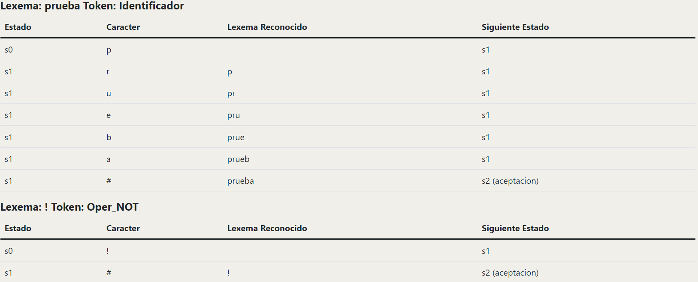

# **MANUAL DE USUARIO**


## Simple C

## **INDICE**- [**MANUAL DE USUARIO**](#manual-de-usuario)
  - [**INDICE**](#indice)
  - [**SOBRE EL PROGRAMA**](#sobre-el-programa)
  - [**REQUISITOS DEL SISTEMA**](#requisitos-del-sistema)
  - [**PROCESO DE USO**](#proceso-de-uso)

## **SOBRE EL PROGRAMA**
El programa analizador de codigo c o c++  tiene como objetivo de generar un reporte de tokens lexicos, reporte de errores lexicos y sintacticos y generar un arbol AST, teniendo como finalidad realizar la lectura del archivo.

Se debe verificar que el archivo a usar sea de extencion .sc antes de empezar a usar el programa. En esta guía del usuario se ofrece una visión general de las características del programa y se indican las instrucciones que deben seguirse paso a paso para realizar diversas tareas.

## **REQUISITOS DEL SISTEMA**
Verifique que la computadora cumpla con los siguientes requisitos antes de usar el programa.

- Contar con un sistema operativo windows 7, 8, 8.1 o 10 u otro sistema operativo que permita usar python 
- Tener instalado python
- Tener un editor de codigo para pogramar(Visual Code Atom, Thonny, etc. )
- si no se contara con un editor de codigo se podra usar el sistema de comando (CMD)

## **PROCESO DE USO**
Para proceder al uso del programa se procedio a usar el editor de codigo Visual Studio Code.


Luego de haberse ejecutado se visualara un menu en el apartado de la consola de Visual Studio Code.

```
-----------MENU-----------
1. Archivo
2. Nombre del archivo
3. salir

=>
```

Se visualizan 3 opciones, para poder seleccionar uno deberemos ingresar el numero que identifica la opcion a realizar

Si no se ingresa una opcion valida se tendra el siguiente mensaje
```
Opcion no valida!
```

Se ingresa el numero 1 se visualiza lo siguiente

```
Ingrese el directorio del archivo 
>>
```
Se devera ingresar la direccion del archivo a leer, si fue leido con exito saldra el siguiente mensaje

```
Archivo leido con exito!
```
Si no fuera leido se vera el siguiente mensaje
```
Archivo no encontrado!
```
Despues de los mensajes estaremos nuevamente en el menu, se procede a ingresar la siguiente opcion que es 2

Se visualizara lo siguiente 
```
Ingrese nombre del archivo 
>> 
```
Se debe ingresar un nombre para nuestro reporte que se estara generando

Se vera el siguiente mensaje
```
Reportes generados con exito!
```
Esto indica que los reporte fueron generados con exito los cual se podra encontrar en la carpeta del programa con el nombre ingresado anteriormente.

Ejemplo


Se abren los reportes generados, contienen lo siguiente

- Tabla de tokens 

- AST 

- Tabla de errores


Luego de haberse generado el reporte estaremos nuevamente en el menu, se procede a ingresar la siguiente opcion que es 3 

La opcion 3 finaliza el programa teniedo el siguiente mensaje

```
Fin del programa!
```


